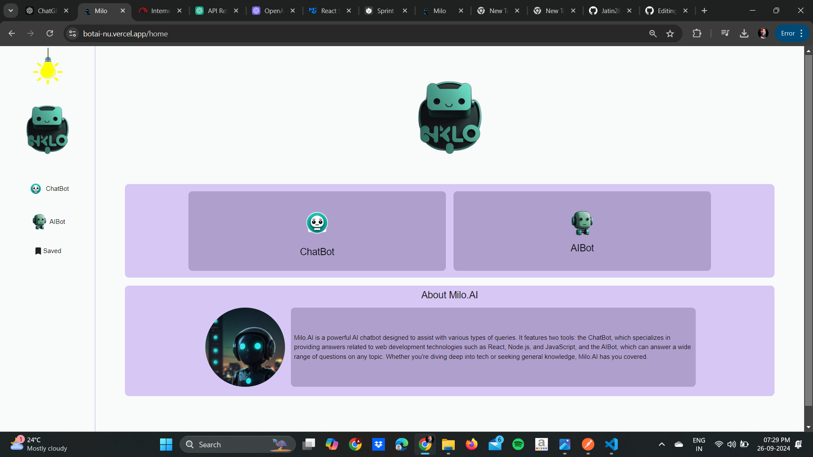
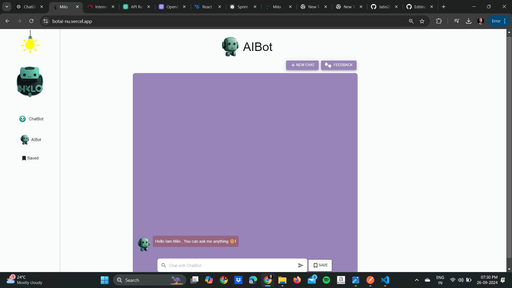
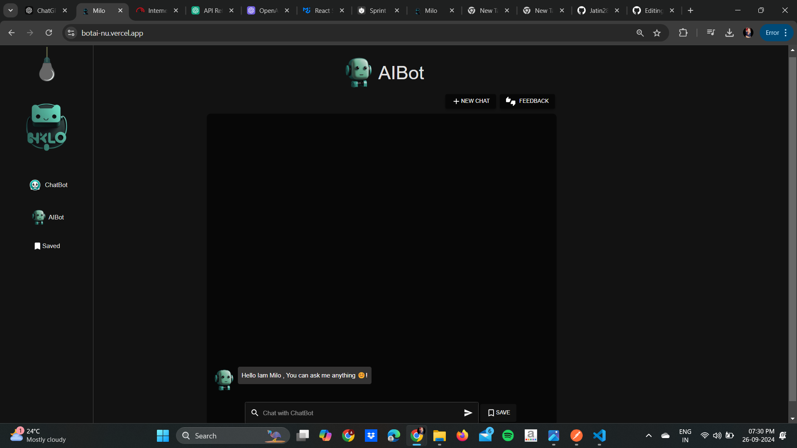

# BotAI

**BotAI** is a React-based application where users can chat with two different bots:
- **ChatBot**: Answers predefined questions about topics related to web development, React, Node.js, and JavaScript.
- **AIBot**: Uses the **Gemini API** to generate responses for any general question, providing more comprehensive and flexible answers.

The application is deployed on **Vercel** and can be accessed via this link: [BotAI on Vercel](https://botai-nu.vercel.app/).

## Features
- **ChatBot**: Limited to predefined questions, helping users with specific development-related queries.
- **AIBot**: Uses the **Google Generative AI (Gemini API)**, capable of handling various general questions and providing intelligent answers.
  
## Technologies Used
- **React.js** for frontend development.
- **Gemini API** for AIBot responses.
- **Vercel** for deployment and hosting.

## Screenshots

### 1. Home Page



### 2. ChatBot Interface


### 3. AIBot Interface


## How to Run the Project Locally

1. **Clone the repository**:
   ```bash
   git clone https://github.com/your-username/BotAI.git
   ```

2. **Navigate to the project directory**:
   ```bash
   cd BotAI
   ```

3. **Install the dependencies**:
   ```bash
   npm install
   ```

4. **Set up the environment variables**:
   Create a `.env` file in the root directory with your API keys. For example:
   ```bash
   GEMINI_API_KEY=your-gemini-api-key
   ```

5. **Run the application**:
   ```bash
   npm start
   ```

6. **Access the app**:
   Go to `http://localhost:3000` in your browser to view the application.

## Live Demo
You can access the live version of the app at [BotAI on Vercel](https://botai-nu.vercel.app/).
